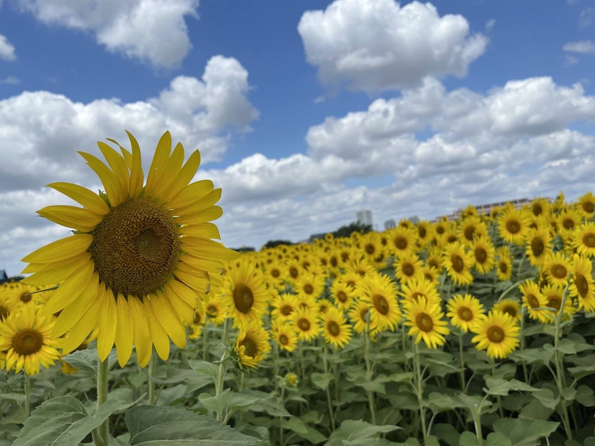
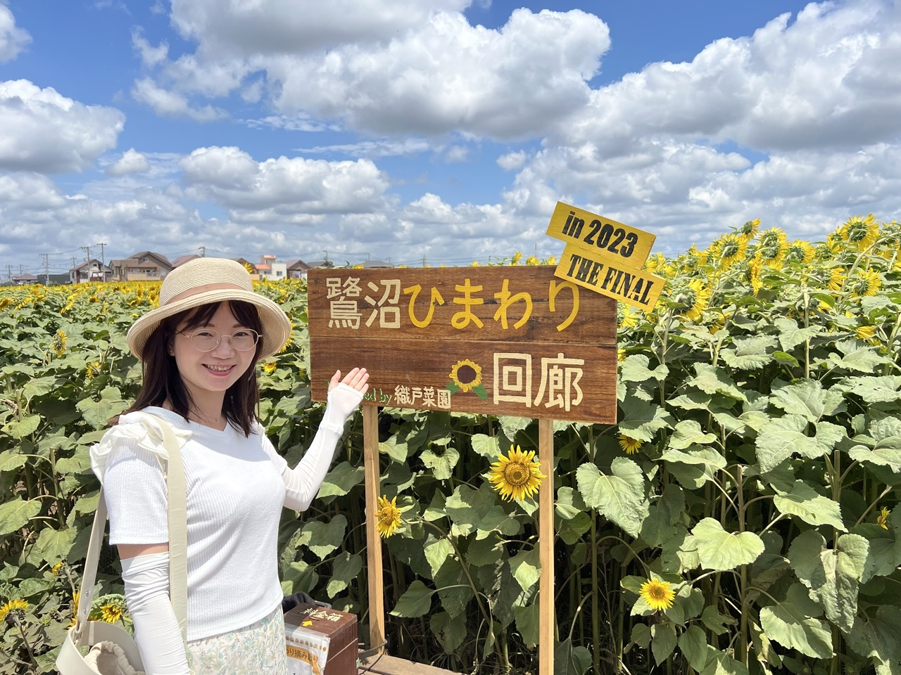
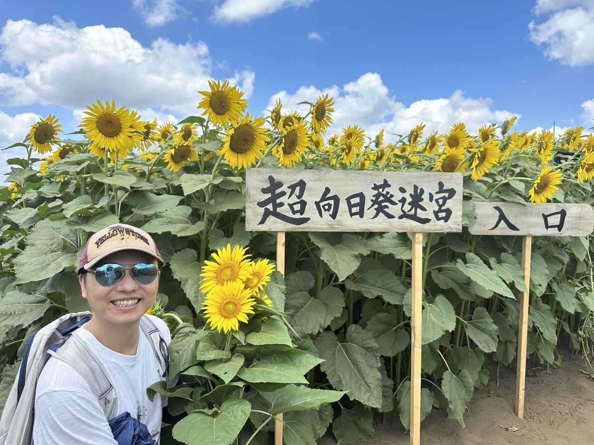
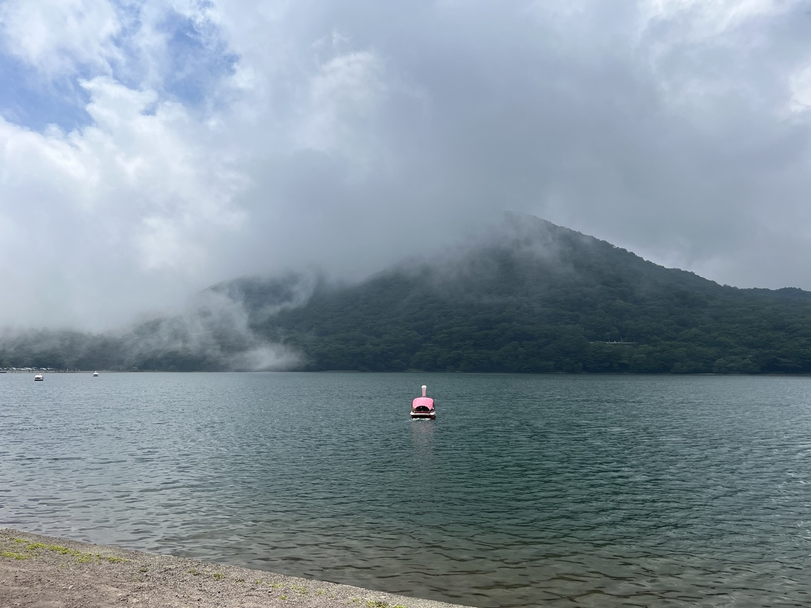
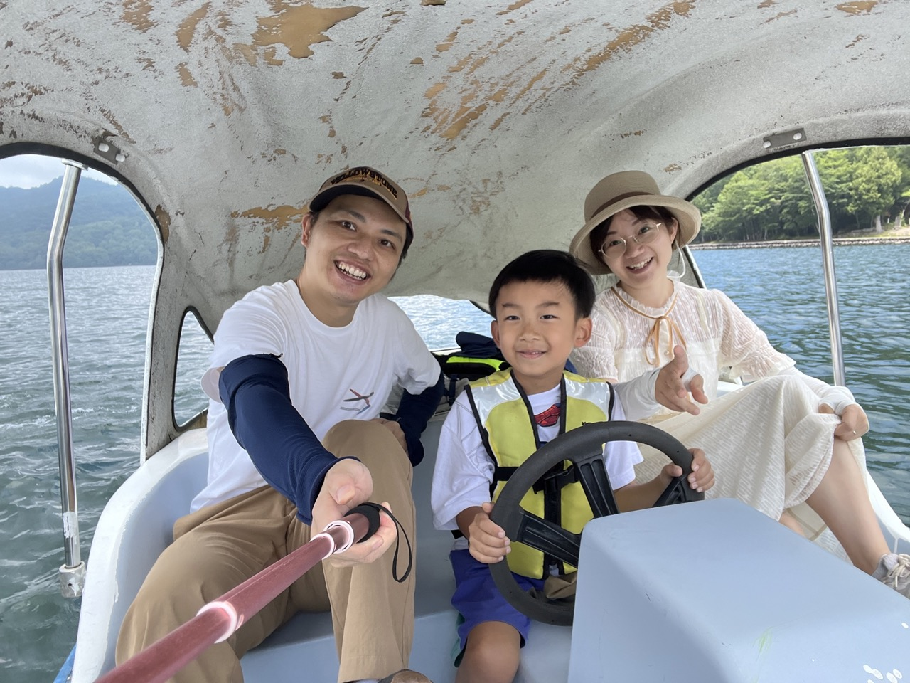
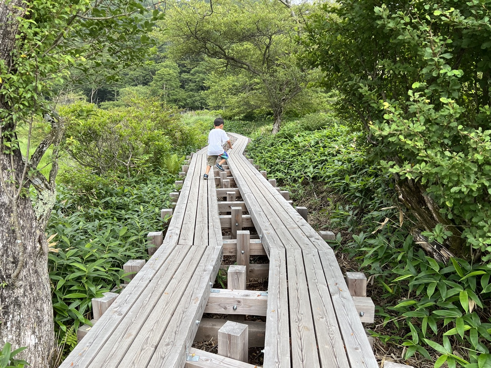
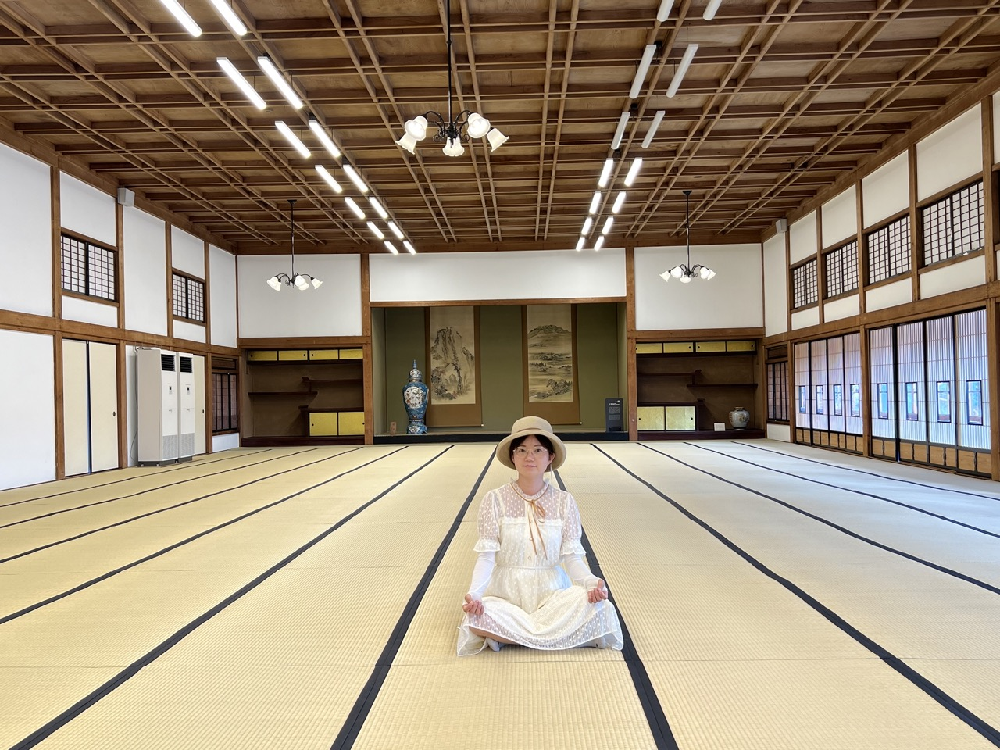

幕張本郷駅の近く，鷺沼ひまわり回廊　（さぎぬま，かいろう）畑　（はた，はたけ）

https://makumemo.com/facility/12900/

迷宮（めいきゅう）maze

赤城山

大沼，

覚満渕（かくまんぶち）　湿原（しつげん）　尾瀬みたいの　木道（もくどう）

https://rurubu.jp/andmore/spot/80007505

前橋公園の臨江閣（りんこうかく）

ひまわり畑（ばたけ）畑（はたけ）

にんじん畑

農園（のうえん）果樹園（かじゅえん）梨園（なしえん）梨園（なしえん）

赤城山（あかぎやま）

足でこぐ

足漕ぎボート

定番

水蒸気　すいじょうき

霧（きり）

ワカサギ釣り

おすそ分け（おすそわけ）

福（ふく）

前橋（まえばし）

帝国（ていこく）

県庁所在地　けんちょうしょざいち

県庁（けんちょう）

水戸（みと）

横浜市（よこはまし）

埼玉県さいたま市

地理（ちり）

集金（しゅうきん）